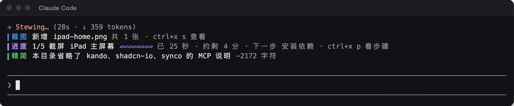
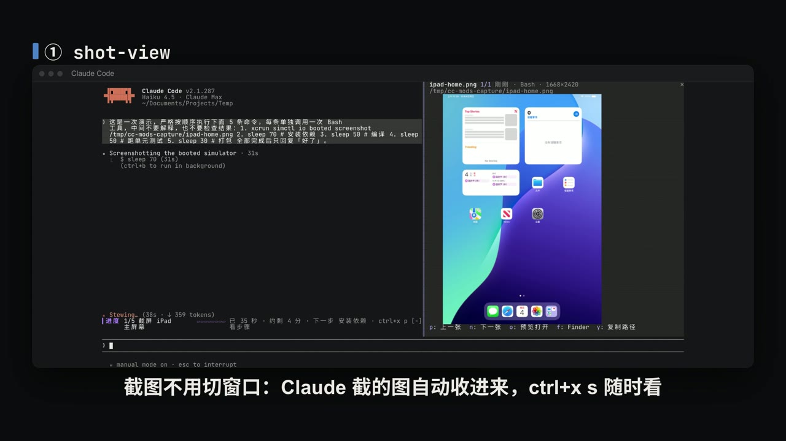
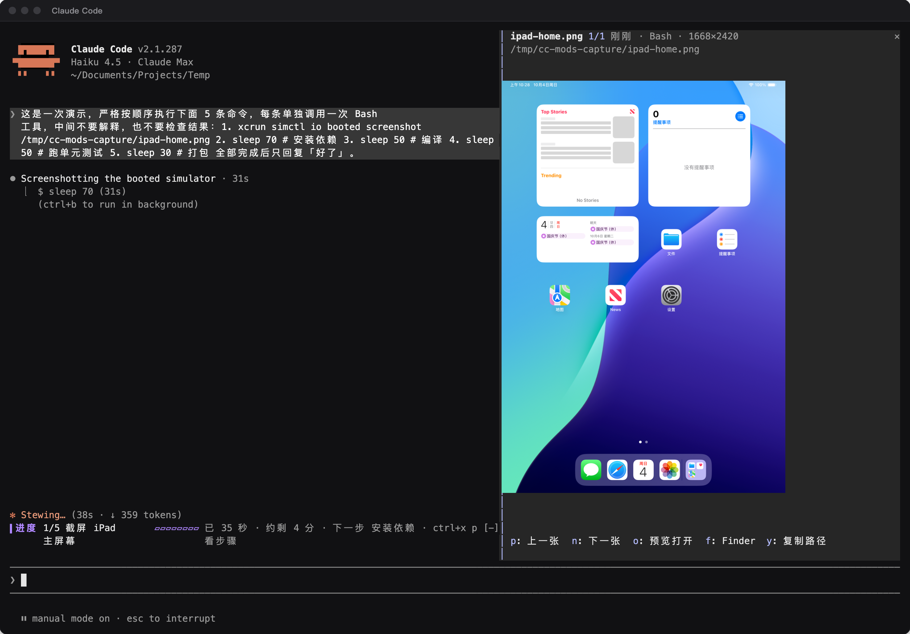
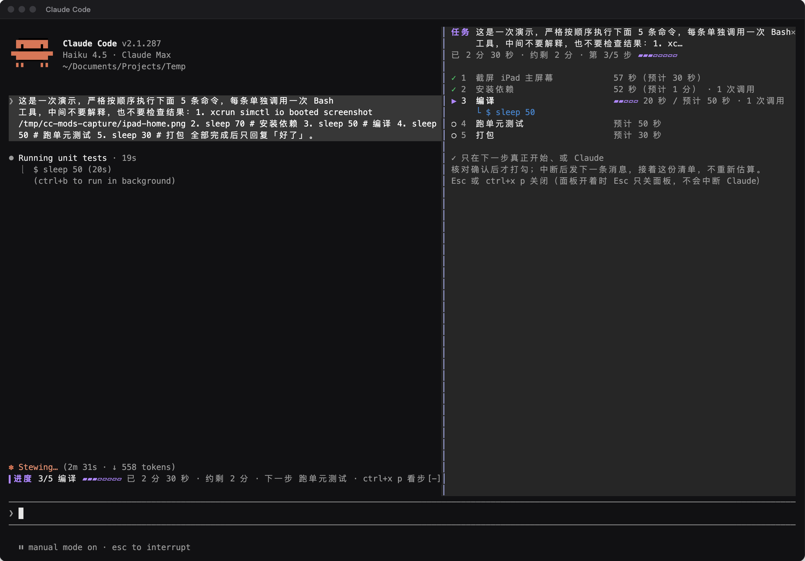
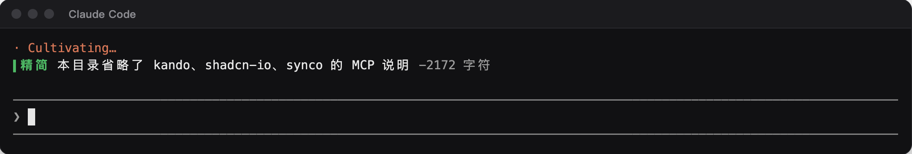

# cc-mods

三个 Claude Code mod：截图面板 **shot-view**、长任务进度 **task-eta**、按目录精简 MCP 说明 **ctx-slim**。三个 mod 各在输入框上方画一行，颜色分别是蓝、紫、绿，不再用 Claude Code 自带的橙色 ⚠ 状态行。



77 秒介绍视频（点图下载 mp4，13.5 MB）：

[](brand/promo/intro/renders/cc-mods-intro.mp4)

## mod 是什么

mod 是 Claude Code v2.1.287 引入的一种插件：插件里放一个 JavaScript / TypeScript 模块，注册一组事件处理函数，在 Claude Code 进程里运行。它能在输入框上方的条带和侧边面板里画界面、注册斜杠命令、在工具调用前后插一手；其中画界面只有 mod 能做，settings 里的 hook、skill 和 MCP 都不行。v2.1.287 起默认开启。官方文档：<https://code.claude.com/docs/en/plugins/mods/overview>

## 安装

需要 Claude Code 2.1.287 或更新版本。

```bash
claude plugin marketplace add Bearisbug/cc-mods
claude plugin install shot-view@cc-mods
claude plugin install task-eta@cc-mods
claude plugin install ctx-slim@cc-mods
```

已经开着的会话要运行 `/reload-plugins` 或新开会话才会加载。

两个面板也可以用快捷键打开。在 `~/.claude/keybindings.json` 里加上（`command:<名字>` 等于输入对应的斜杠命令，只能放在 `Chat` 上下文）：

```json
{
  "bindings": [
    {
      "context": "Chat",
      "bindings": { "ctrl+x s": "command:shots", "ctrl+x p": "command:steps" }
    }
  ]
}
```

不配快捷键时，输入 `/shots`、`/steps` 效果相同。

## shot-view · 截图面板



- Claude 用 Read 看了一张 PNG，或者它执行的命令、命令输出里出现了 10 分钟内写出的 PNG（比如 `xcrun simctl io booted screenshot`、Playwright 截图），这张图就进入列表，最多保留最近 60 张。
- 有新截图时，输入框上方出现蓝色的「▍截图 新增 xxx.png 未读 N 张 · ctrl+x s 查看」；截图都标为已读后这一行不再出现。
- `/shots`（ctrl+x s）打开右侧面板，Claude 正在工作时也能立刻打开。面板只显示未读的截图，顶行写着当前是第几张未读、已读几张。`p` / `n` 翻页，`r` 标为已读（看过、不用再看时按，只是翻过不算），`u` 撤销最近一次已读并跳回那一张，`o` 用「预览」打开，`f` 在 Finder 里显示，`y` 复制路径；Esc 或再按一次 ctrl+x s 关闭，面板开着时 Esc 只关面板，不会中断 Claude。
- 标为已读的截图不再出现，全部读完时面板显示「✓ 截图都看完了」。Claude 再读一遍没改过的同一个文件，它仍算已读；同一路径被新截图覆盖（修改时间变了），就重新算未读。
- 截图文件被删除或移走后，它会自动从面板里去掉，面板注明另有几张已不在；文件被原地覆盖后，面板显示的是新内容。
- 面板里直接显示图片，要求终端支持 kitty 图形协议。kitty 和 Ghostty 默认开启；其他支持该协议的终端，在 `~/.claude/settings.json` 的 `env` 里加 `"CLAUDE_CODE_FORCE_TERMINAL_IMAGES": "1"`。终端不支持时面板只显示文件名，按 `o` 用「预览」看。
- 只能在 macOS 上用：读图片尺寸靠 `sips`，打开文件靠 `open`。

## task-eta · 长任务进度



- 一轮任务跑满 3 分钟，task-eta 向当前会话的模型发一个旁路问题，估出剩余步骤；不满 3 分钟时按一下 ctrl+x p 会当场估算。
- 输入框上方出现紫色进度行，例如「▍进度 2/5 跑单元测试 ▰▰▱▱ 已 4 分 · 约剩 6 分 · 下一步 修复失败用例 · ctrl+x p 看步骤」。剩余时间按已完成步骤的实际快慢校准。
- `/steps`（ctrl+x p）展开「任务步骤」面板：每一步用 ✓ / ▶ / ○ 标状态，「–」表示 Claude 核对后认为这一步后来不需要了；每一步写着实际用时、预计用时和调用次数，当前步骤下面显示 Claude 正在执行的命令。面板里按 `c` 让 Claude 重新核对；一轮已经结束、清单还没完成时，按 `d` 把整份清单标为完成。
- 只有下一步真正开始、或 Claude 核对确认后，才给一步打勾。一轮结束时 Claude 核对一次，进度行显示结果：任务完成、等你回复、未完成、已中断、出错停下；核对试了 3 次都没成功时显示「未能核对」。被中断或没做完时，发下一条消息会接着原来那份清单，不重新估算；`/clear` 会清掉清单。
- 估算和过程中的核对通过 `$.model.fork` 发请求，每轮最多 6 次；一轮结束时的核对不受这个次数限制，失败后隔 5 秒、10 秒各重试一次。请求复用会话的 prompt cache，但仍然计入你的用量。

## ctx-slim · 按目录精简 MCP 说明



- 每接一个 MCP 服务器，它的使用说明都会跟着每一轮请求发给模型。ctx-slim 在 `prompt.attachment` 上拦下 MCP 说明，按你配的规则去掉当前目录用不上的服务器那一节；工具本身照常可用。
- 每个会话第一次精简时，输入框上方出现一次绿色提示「▍精简 本目录省略了 … 的 MCP 说明 −N 字符」，30 秒后消失。
- **默认什么都不做**，要先配规则。

### 配置 ctx-slim

规则可以在 `/config` 里的「MCP 说明保留规则」填一行，或者运行 `/plugin configure ctx-slim@cc-mods`，也可以直接写进 `~/.claude/settings.json`：

```json
{
  "pluginConfigs": {
    "ctx-slim@cc-mods": {
      "options": {
        "rules": "kando: path~kando; synco: text=<!-- synco:project-context:start | path~synco; shadcn-io: file=package.json"
      }
    }
  }
}
```

规则格式是 `服务器: 条件 | 条件; 服务器: 条件`，多条规则用分号或换行隔开：

| 写法 | 含义 |
|---|---|
| 服务器名 | MCP 说明里 `## ` 后面的名字，不区分大小写 |
| `path~子串` | 当前目录路径里包含这个子串，不区分大小写 |
| `file=文件名` | 从当前目录往上能找到这个文件；当前目录在 HOME 下时只找到 HOME 为止 |
| `text=文字` | 当前目录及上级目录的 CLAUDE.md 或 AGENTS.md 里含有这段文字 |

列出的服务器只要有一个条件成立就保留它的说明，否则省略；没列出的服务器一律保留。条件里不能出现 `;` 和 `|`，写错的部分会被跳过，不会因此误删说明。

上面那段示例是作者自己的规则：kando 的说明只在路径含 kando 时保留，synco 的说明在 CLAUDE.md 里有 Synco 的 project-context 标记、或路径含 synco 时保留，shadcn-io 的说明只在能找到 `package.json` 的前端项目里保留。

## 安全

mod 以你的用户权限在 Claude Code 进程里运行，不在沙箱里。装之前可以对插件目录运行 `claude plugin validate <目录>`，它不执行代码，只列出 mod 处理哪些事件、调用哪些接口：

| mod | 处理的事件 | 调用的接口 |
|---|---|---|
| shot-view | `tool.call`、`command.run`、`ui.render` | `$.process.run`（只运行 `sips`、`open`）、`$.fs.stat`、`$.ui.*`、`$.state.*` |
| task-eta | `turn.start`、`tool.call`、`turn.complete`、`command.run`、`session.end`、`ui.render` | `$.model.fork`、`$.clock.*`、`$.ui.*` |
| ctx-slim | `prompt.attachment`、`ui.render`（没配规则时不注册任何钩子） | `$.fs.exists`、`$.fs.ancestors`、`$.env.get`、`$.ui.*`、`$.state.*` |

## 开发

```bash
claude plugin validate shot-view      # 静态检查
claude plugin test shot-view          # 跑 tests/ 里的测试
claude --plugin-dir ./shot-view       # 只在这一个会话里加载，存盘自动重载
```

`brand/promo/intro/` 是介绍视频的源码（HyperFrames 0.8.96 + GSAP），分镜在 `storyboard.md`，录屏数据在 `assets/term.js`。配乐文件不在仓库里，先用 `bash tools/cut_music.sh <原曲>` 从原曲剪出 `assets/audio.wav`，再在该目录运行 `npm ci`、`npx hyperframes render . -o renders/cc-mods-intro.mp4 --strict` 重新出片。

README 和视频里的终端画面来自真实会话的录屏数据；shot-view 面板里的图片区域是后期合成的，因为录屏用的终端模拟器不支持 kitty 图形协议。视频里的计数器 mod 是[官方文档](https://code.claude.com/docs/en/plugins/mods/overview)的示例，拦截 `rm -rf` 的是官方示例 [blast-radius](https://github.com/anthropics/claude-code-playground/tree/main/claude-code/mods/blast-radius)。配乐：《栖谷来信》（Letter from an old friend），制造木屋/陈越龙，版权归原作者，不在本仓库的 MIT 许可之内。

## 许可

[MIT](LICENSE)
